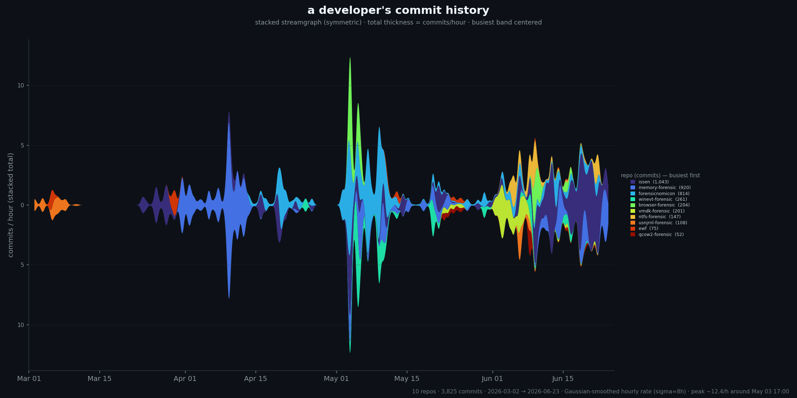
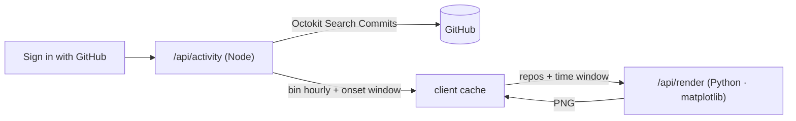

# GitHub Activity Plotter

**Sign in with GitHub and watch your commit history bloom into a symmetric streamgraph.** A Rorschach inkblot of every late night you shipped — a small, frictionless pat on the back for the grind.



The band thickness at any moment is your commits-per-hour; each repo is a colored ribbon, busiest one straddling the centerline. Toggle repos on and off and drag the time window — the chart re-blooms as you fiddle.

## Quickstart

```bash
pnpm install
cp .env.example .env.local     # then fill in the three values (see below)
pnpm dlx vercel dev            # runs Next.js + the Python renderer together
```

Open http://localhost:3000, click **Sign in with GitHub**, and your chart renders itself.

> Use `vercel dev` (not `next dev`) for local development: the chart is rendered by a Python serverless function, which only `vercel dev` serves locally. `next dev` runs everything _except_ the chart endpoint.

### The three env values

| Variable                                | Where it comes from                                                                                                      |
| --------------------------------------- | ------------------------------------------------------------------------------------------------------------------------ |
| `AUTH_GITHUB_ID` / `AUTH_GITHUB_SECRET` | A [GitHub OAuth App](https://github.com/settings/developers) — callback `http://localhost:3000/api/auth/callback/github` |
| `AUTH_SECRET`                           | `openssl rand -base64 32`                                                                                                |

## How it works



- **Auth** — Auth.js (NextAuth v5) with a single GitHub provider. The OAuth token lets the app read your authored commits (public always; private with the `repo` scope).
- **Data** (`/api/activity`, Node) — pulls your commits via the Search Commits API, bins them into per-repo hourly counts, and computes the default time window: it opens _just before your activity ramps up_. The heavy fetch happens **once**.
- **Render** (`/api/render`, Python) — a matplotlib port of the symmetric stacked streamgraph. The client re-POSTs the cached series with your current repo selection and window; debounced, with the in-flight render aborted when you keep fiddling, so it stays snappy.

## Defaults that just work

- **All repos** selected.
- **Time window** auto-starts just before activity got intense (smoothed-onset detection), so the chart opens on the interesting part of your history.

## Privacy

GitHub Activity Plotter reads commit _metadata_ (repo name + timestamp) to draw the chart. It renders on the fly and **does not store your code or your commits** — there is no database. The GitHub token lives only in your encrypted session cookie.

## Stack

Next.js 16 (App Router) · shadcn/ui + Tailwind v4 · Auth.js v5 · Octokit · matplotlib (Vercel Python function). Deploy with `vercel --prod`.

## Tests

```bash
pnpm test                     # TypeScript: binning + onset detection + repo labels
python3 api/test_inkblot.py   # Python: renderer contract invariants
```
